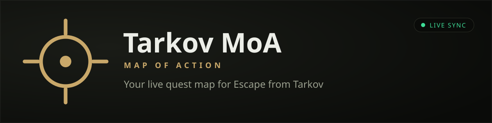

<p align="center">
  
</p>

<p align="center">
  <a href="https://github.com/mopocop/Tarkov-moa/releases/latest"></a>
  <a href="https://github.com/mopocop/Tarkov-moa/releases"></a>
  
  
</p>

<h3 align="center">A live quest map for Escape from Tarkov.<br>Your objectives, extracts and real-time position — synced straight from the game.</h3>

<p align="center">
  <a href="https://github.com/mopocop/Tarkov-moa/releases/latest">
    
  </a>
</p>

<p align="center"><sub>Free · Windows 10/11 · ~12&nbsp;MB · updates itself · no account, no sign-up</sub></p>

---

<!-- SCREENSHOTS: drop 2–3 real screenshots or a short GIF here once captured.
     Suggested: the live map with your position, squad mode with a teammate, the quest list.
     Until then this placeholder stays so the page still reads well. -->
<p align="center"><sub>📸 Screenshots coming soon.</sub></p>

## What it does

Tarkov MoA runs on a second monitor (or off to the side) and quietly keeps a map up to date while you play — no tabbing out, no manual ticking.

- **Your live position.** Your arrow moves on the map as you play. Take an in-game screenshot and the map jumps to you, on the right map, even underground.
- **Automatic quest tracking.** It reads the game's own log files and updates your objectives — accepted, completed, failed — on its own.
- **Map intel.** Extracts, spawns, loot and hazards for every map, with filters so you see only what you care about.
- **Squad mode.** Share your live position, custom markers and drawings with friends — everyone sees the same map in real time.
- **Six languages.** English, Português (Brasil), Русский, 日本語, 中文 and Español — it matches your game's language automatically.
- **Updates itself.** New versions install quietly in the background and are cryptographically signed, so you always have the latest without hunting for downloads.

## Installing — about a minute

1. Click **[Download for Windows](https://github.com/mopocop/Tarkov-moa/releases/latest)** and run the file you get.
2. Windows may show a blue **“Windows protected your PC”** box. This is normal for small independent apps. Click **More info**, then **Run anyway**. (Why this happens — and why it's safe — is just below.)
3. Open the app, point it at your Tarkov folder once when it asks, and you're set. It'll take you through the rest.

That's it. From then on it stays out of your way and updates itself.

## Is it safe? Is it a cheat?

Short answer: **yes, it's safe, and no, it's not a cheat.**

- **It only reads files the game already creates** — log files and your own screenshots. It never reads or touches the game's memory, never injects anything, and gives you nothing in a raid that you couldn't write down on paper yourself. It can't get you banned for cheating because it doesn't do anything a cheat does.
- **Why the Windows warning, then?** The app isn't signed with a paid certificate yet (those cost money every year), so Windows shows a generic “unknown publisher” caution for *any* small app without one. It's not a virus warning. The entire source code is right here on this page for anyone to read, and the automatic updates are cryptographically signed so you always get the genuine app.

---

<details>
<summary><b>For developers — build from source &amp; contribute</b></summary>

<br>

Tarkov MoA is a [Tauri 2](https://tauri.app) desktop app: a React + TypeScript front-end with a small Rust backend, plus a lightweight Node WebSocket relay that powers squad mode. Quest, map and POI data comes from the excellent [tarkov.dev](https://tarkov.dev) API.

```bash
# prerequisites: Node 20+, Rust (stable), and the Tauri prerequisites for your OS
npm install
npm run dev          # run the app in dev mode (Vite + Tauri)
npm test             # client unit tests (vitest)
```

Squad mode runs against a local relay during development:

```bash
cd server
npm install
npm start                                   # starts the relay on ws://localhost:8787
npm run bot -- ws://localhost:8787 - Pestily green <mapId> 60000   # optional: a fake teammate for testing
```

**Where things live**

| Path | What's there |
|------|--------------|
| `src/` | React UI — map, rail, onboarding, squad, settings, i18n |
| `src/i18n/` | Internationalization setup + locale files (`locales/*.json`) |
| `src-tauri/` | Rust backend (log parsing, game-folder detection, updater) |
| `server/` | Node WebSocket relay for squad mode |
| `shared/` | Types/protocol shared between app and relay |

Contributions are welcome — see **[CONTRIBUTING.md](CONTRIBUTING.md)** for setup details, branch conventions and how pull requests are reviewed.

</details>

---

<p align="center"><sub>
Unofficial fan-made tool — not affiliated with, endorsed by, or connected to Battlestate Games.<br>
Quest, map &amp; POI data by <a href="https://tarkov.dev">tarkov.dev</a> · map rendering by Leaflet · icons by Phosphor.<br>
Released under the <a href="LICENSE">MIT license</a>.
</sub></p>
